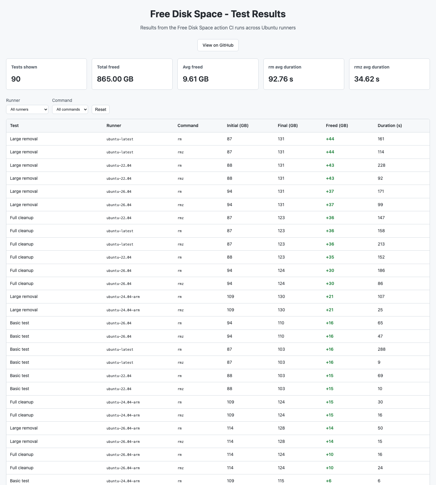

# Free Disk Space - Action


A GitHub Action to free disk space on Ubuntu runners by removing unnecessary software and files.

> 💡 **For Contributors & AI Agents**: See [AGENTS.md](AGENTS.md) for technical details, development setup, and contribution guidelines.

## 📑 Table of Contents

- [Compatibility](#compatibility)
- [Available Options](#available-options)
- [What's New in v3](#whats-new-in-v3-)
- [Quick Start](#quick-start)
- [Common Use Cases](#common-use-cases)
- [Size Savings](#size-savings)
- [FAQ](#faq)
- [Contributing](#contributing)
- [Changelog](CHANGELOG.md)

## Compatibility


-supported-green?logo=ubuntu&logoColor=white)


All runners are tested on every push via the [CI workflow](https://github.com/endersonmenezes/free-disk-space/actions/workflows/testing.yaml).

## Available Options

| Input | Description | Required | Default |
|-------|-------------|----------|---------|
| `principal_dir` | Principal directory to check disk space | No | `/` |
| `remove_android` | Remove Android SDK and libraries | No | `false` |
| `remove_dotnet` | Remove .NET runtime and SDKs | No | `false` |
| `remove_haskell` | Remove Haskell (GHC) | No | `false` |
| `remove_tool_cache` | Remove tool cache directory | No | `false` |
| `remove_swap` | Remove swap storage | No | `false` |
| `remove_packages` | Space-separated list of packages to remove | No | `false` |
| `remove_packages_one_command` | Remove all packages in one command | No | `false` |
| `remove_folders` | Space-separated list of folders to remove | No | `false` |
| `rm_cmd` | Removal command: `rm` (safe) or `rmz` (faster) | No | `rm` |
| `rmz_version` | Version of rmz to use (required if `rm_cmd=rmz`) | No | `3.1.1` |
| `testing` | Testing mode (echoes commands instead of running) | No | `false` |

## What's New in v4 🚀

- **🧪 Ubuntu 26.04 Preview Support**: Tested on `ubuntu-26.04` and `ubuntu-26.04-arm` runners (experimental)
- **🌐 GitHub Pages Dashboard**: CI test results are published to GitHub Pages — see it live at [endersonmenezes.github.io/free-disk-space](https://endersonmenezes.github.io/free-disk-space/)
- **🔥 rmz Support**: Use `rmz` for up to 3x faster file deletion
- **🛠️ DevContainer**: Full development environment with Docker-in-Docker
- **✅ Pre-commit Hooks**: Automated code quality checks with shellcheck and actionlint
- **📦 Workflow Templates**: Refactored tests using reusable workflows
- **📝 Enhanced Documentation**: Complete API reference and examples

### Migration from v3 to v4

The v4 is fully backward compatible with v3. To migrate:

```yaml
# Before (v3)
- uses: endersonmenezes/free-disk-space@v3
  with:
    remove_android: true

# After (v4) - works the same
- uses: endersonmenezes/free-disk-space@v4
  with:
    remove_android: true
    
# After (v4) - with new features
- uses: endersonmenezes/free-disk-space@v4
  with:
    remove_android: true
    rm_cmd: "rmz"        # Faster deletion
    rmz_version: "3.1.1" # Specify rmz version
```

**Breaking Changes:** None! All v3 configurations work in v4.

**New in v4:**
- Support for `ubuntu-26.04` and `ubuntu-26.04-arm` preview runners
- GitHub Pages dashboard with CI test results

**New Optional Parameters:**
- `rm_cmd`: Choose between `rm` (default) or `rmz` (faster)
- `rmz_version`: Specify rmz version when using `rm_cmd: rmz`

## Inspiration

Free Disk Space Action are inspired by [jlumbroso/free-disk-space](https://github.com/jlumbroso/free-disk-space)

## Motivation

At work I came across a huge Docker image that still needed to be analyzed by a local security tool. This consumed the entire Runner and in addition to the repository I found, I needed to remove some packages, which led me to create a modification of the original repository.

I will maintain a Stable version of this project.

## Quick Start

```yaml
name: Free Disk Space (Ubuntu)
on:
  - push

jobs:
  free-disk-space:
    runs-on: ubuntu-latest
    steps:
      - name: Free Disk Space
        uses: endersonmenezes/free-disk-space@v4  # Use @main for latest, @v4 for stable
        with:
          remove_android: true
          remove_dotnet: true
          remove_haskell: true
          remove_tool_cache: true
          remove_swap: true
          remove_packages: "azure-cli google-cloud-cli microsoft-edge-stable google-chrome-stable firefox postgresql* temurin-* *llvm* mysql* dotnet-sdk-*"
          remove_packages_one_command: true
          remove_folders: "/usr/share/swift /usr/share/miniconda /usr/share/az* /usr/local/lib/node_modules /usr/local/share/chromium /usr/local/share/powershell /usr/local/julia /usr/local/aws-cli /usr/local/aws-sam-cli /usr/share/gradle"
          rm_cmd: "rm"  # Use 'rmz' for faster deletion (default: 'rm')
          rmz_version: "3.1.1"  # Required when rm_cmd is 'rmz'
          testing: false
```

## Common Use Cases

#### Docker Build with Large Images
```yaml
- name: Free Disk Space for Docker
  uses: endersonmenezes/free-disk-space@v4
  with:
    remove_android: true
    remove_dotnet: true
    remove_haskell: true
    rm_cmd: "rmz"  # Faster cleanup
    
- name: Build Docker Image
  run: docker build -t myapp:latest .
```

#### Node.js Project with Many Dependencies
```yaml
- name: Free Disk Space for Node
  uses: endersonmenezes/free-disk-space@v4
  with:
    remove_android: true
    remove_haskell: true
    remove_packages: "google-cloud-cli azure-cli"
    
- name: Install Dependencies
  run: npm ci
```

#### Python Data Science Workflow
```yaml
- name: Free Disk Space for Python
  uses: endersonmenezes/free-disk-space@v4
  with:
    remove_android: true
    remove_dotnet: true
    remove_folders: "/usr/share/swift /usr/local/julia"
    
- name: Install Python Packages
  run: pip install pandas numpy scikit-learn
```

### Performance Optimization with rmz

For faster file deletion, you can use `rmz` instead of the default `rm` command:

```yaml
- name: Free Disk Space (with rmz)
  uses: endersonmenezes/free-disk-space@v4
  with:
    remove_android: true
    remove_dotnet: true
    rm_cmd: "rmz"  # Faster deletion (~3x faster)
    rmz_version: "3.1.1"
```

**Note:** `rmz` is a Rust-based alternative to `rm`, providing significantly faster deletion for large directories. Learn more at [SUPERCILEX/fuc](https://github.com/SUPERCILEX/fuc).

## Size Savings

These numbers are no longer maintained by hand — every CI run publishes fresh results to the **live dashboard**:

[](https://endersonmenezes.github.io/free-disk-space/)

📊 **Live dashboard:** [endersonmenezes.github.io/free-disk-space](https://endersonmenezes.github.io/free-disk-space/) — filter by runner (`ubuntu-22.04` → `ubuntu-26.04`, x86_64 and ARM64) and by removal command (`rm` vs `rmz`) to see what each option frees and how long it takes.

Rule of thumb from the latest runs:

- **Full cleanup**: ~30-36 GB freed on x86_64, ~10-15 GB on ARM64
- **Large removal**: ~37-44 GB freed on x86_64
- **rmz** is consistently 2-3x faster than `rm` on large deletions

### Recommended Packages to Remove

**Ubuntu Latest (x86_64):**
```yaml
remove_packages: "azure-cli google-cloud-cli microsoft-edge-stable google-chrome-stable firefox postgresql* temurin-* *llvm* mysql* dotnet-sdk-*"
```

**Ubuntu ARM64:**
```yaml
remove_packages: "azure-cli dotnet-sdk-8.0 temurin-* *llvm* mysql* firefox"
```

### Recommended Folders to Remove

**Ubuntu Latest (x86_64):**
```yaml
remove_folders: "/usr/share/swift /usr/share/miniconda /usr/share/az* /usr/local/lib/node_modules /usr/local/share/chromium /usr/local/share/powershell /usr/local/julia /usr/local/aws-cli /usr/local/aws-sam-cli /usr/share/gradle"
```

**Ubuntu ARM64:**
```yaml
remove_folders: "/usr/share/swift /usr/local/share/powershell /usr/local/lib/node_modules /usr/share/az* /usr/local/aws-cli"
```

_In our action you can see more folders and packages to delete, but it is your responsibility to know what you are doing._

_Initially I created this project with the intention of doing all this and then being able to use Docker and Python, our tests will prove this._

## FAQ

**Q: Should I use rm or rmz?**
- Use `rm` (default) for compatibility and safety
- Use `rmz` when you need maximum performance

**Q: How much time does this save in my CI/CD?**
- Typical savings: 2-5 minutes per workflow run
- With rmz: Up to 3x faster deletion operations

**Q: Is it safe to remove all these packages?**
- The defaults are safe for most workflows
- Test with your specific needs first
- Use `testing: true` to see what would be removed

**Q: How can I debug issues?**
- Enable disk space logging before and after (see examples above)
- Use `testing: true` to see what would be removed without actually removing
- Check the [AGENTS.md](AGENTS.md) for troubleshooting details

## Contributing

We welcome contributions! Whether you're fixing bugs, adding features, or improving documentation, your help is appreciated.

**Quick Start:**
1. Fork the repository
2. Create a feature branch
3. Make your changes
4. Open a Pull Request

**For detailed instructions**, see [AGENTS.md](AGENTS.md) which includes:
- Development setup (DevContainer & manual)
- Testing guidelines
- Code style standards
- Pre-commit hooks usage
- Architecture details

## Acknowledgements

This project, despite being on my personal profile purely formally, is part of an NGO we have in Brazil, responsible for helping young people and adults learn to program and tackle real-world projects. Learn more at [codaqui.dev](https://codaqui.dev).

The GitHub Pages dashboard concept used to visualise CI test results was proposed by
[Fabian Rost](https://github.com/fbnrst) in
[PR #28](https://github.com/endersonmenezes/free-disk-space/pull/28)
and is based on his
[GitHub Hosted Runners Disk Space](https://github.com/fbnrst/Github-Hosted-Runners-Disk-Space)
project.

## Changelog

See [CHANGELOG.md](CHANGELOG.md) for the full version history.

## License

This project is licensed under the terms specified in the [LICENSE](LICENSE) file.